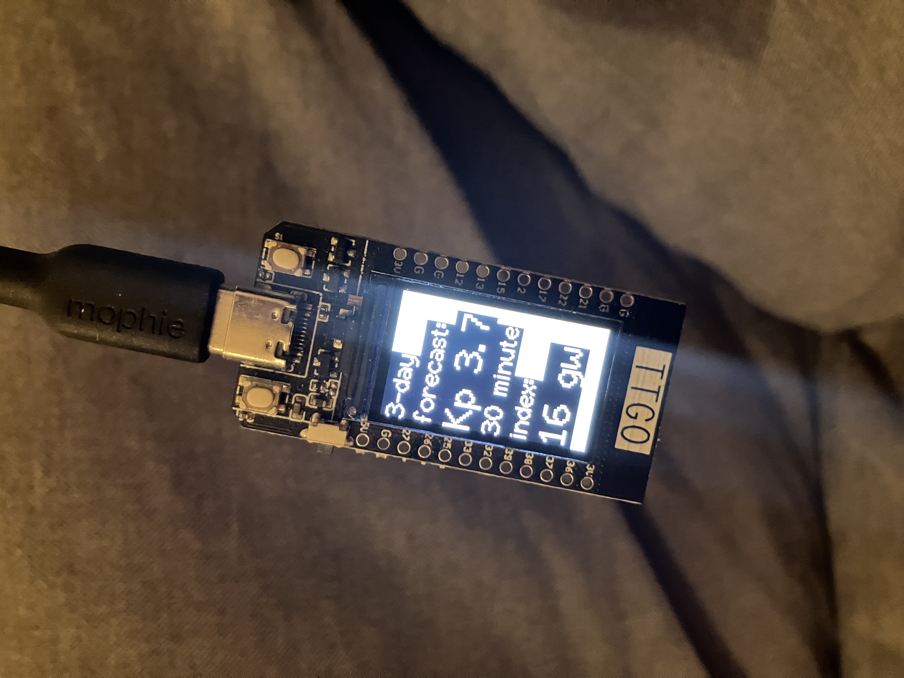

# aurora-kp-display

To allow us to follow the Sun's output of solar winds, we try to stay up to date with the measurements
of the Space Weather Prediction Center (SWPC). Since life will get in the way of tracking a website or
app, I wanted to create something that is really accessible can can be read in a glance. Something like
my clock on the wall or the thermometer at the window.

The second version of this is build on the ESP32S3 with 480x480 color display.
  

The first version of this is build on the LILYGO TTGO T-Display.
  

